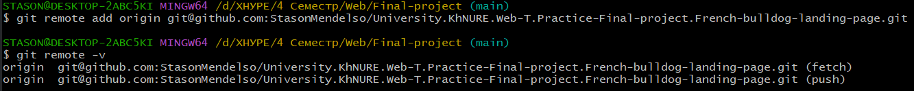

# University.KhNURE.Web-T.Practice-Final-project.French-bulldog-landing-page

## What is the project about?

Repository is for educational purpose - doing final project on the
discipline *"Web technologies and web design"* in
the university "[Kharkiv National University of Radio Electronics][1]".

## What is the purpose of this project?

The **purpose** of the project is ***doing final project***(landing page) on the discipline *"Web technologies and web
design"*.

## Getting Started

There isn't a real or PET project, it's project about doing the practical task from discipline in university. So, you
need
download the code from the **main** branch for showing the completed task. For this, see the sections below.

### Prerequisites

There isn't a real or PET project, it's project about doing the final project from discipline in university. So, you
need download the code from the main branch for showing the app. For this, see the sections below. Also, you can open it on
GitHub pages.

### Installation Instruction

#### How to download project on my local machine?

For downloading the project locally you can use two variants:

1. Download the ZIP archive from the repository page.

   The method is easy, the next steps helps you:
2. Find the button `Code` and press it.
3. Find the button `Download ZIP` and press it. The downloading must start.
4. Unzip the archive in soe directory and run the IDEA in this directory.

Project has been installed.

1. Use the `Git` for downloading the repository locally.

   The method a lit bit difficult, but the project will be downloaded with the help
   of several commands, and not manually, as in the previous method. For this method
   you **need** to [install][4] the `Git Bash` on your computer, make some configuration and have a primary skill of
   using this system of version control.
2. Enter your [name][5], [email][6] of GitHub account locally on your machine.
3. Create an empty directory and initialize it as git repository. Use the next
   command - `git init`.
4. Adds this repository to yours with name `origin` (you can change it, if you want):
    ```
   $ git remote add origin git@github.com:StasonMendelso/University.KhNURE.Web-T.Practice-Final-project.French-bulldog-landing-page.git
   ```
   But you need configure your SSH connection to your GitHub profile in Git Bash. See more [here][7].

   For viewing that the repository has been added successfully to your local
   repository, you need execute the next command and get the following result:
   ```
   $ git remote -v
   ```
   

   After this step your local repository has got a 'connection' to the remote
   project from the GitHub repository.
5. For downloading the project use the following command:
   ```
   $ git pull origin main
   ```
   After these steps your project directory must contain the project files from
   GitHub repository. In addition to, you can create a new branch, make some
   changes and create a pull request for suggesting your improvements. Also, all
   changes are observed by the `git` and you can always make a rollback of
   all changes `git reset --hard`.

### Running the application

Run the project using the [index.html](index.html) file.

## Author

* **Stanislav Hlova** - *All work* - [StasonMendelso](https://github.com/StasonMendelso)

[1]:https://nure.ua/

[4]:https://git-scm.com/downloads

[5]:https://docs.github.com/en/get-started/getting-started-with-git/setting-your-username-in-git

[6]:https://docs.github.com/en/account-and-profile/setting-up-and-managing-your-personal-account-on-github/managing-email-preferences/setting-your-commit-email-address

[7]:https://docs.github.com/en/authentication/connecting-to-github-with-ssh